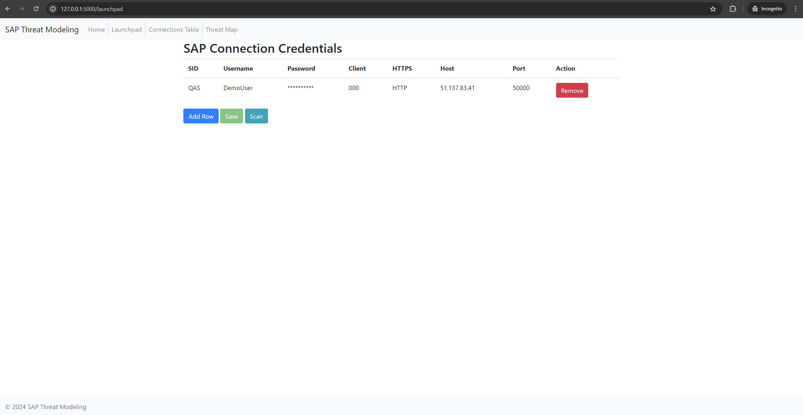
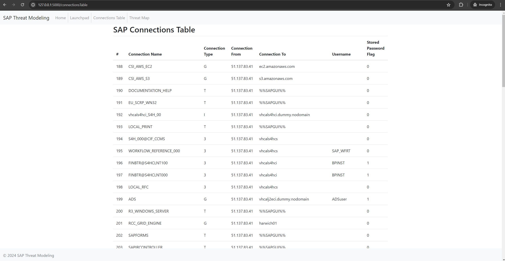
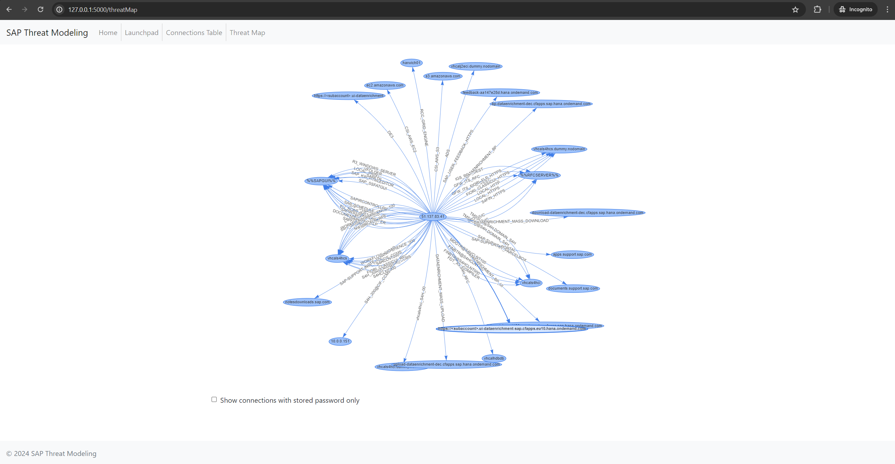
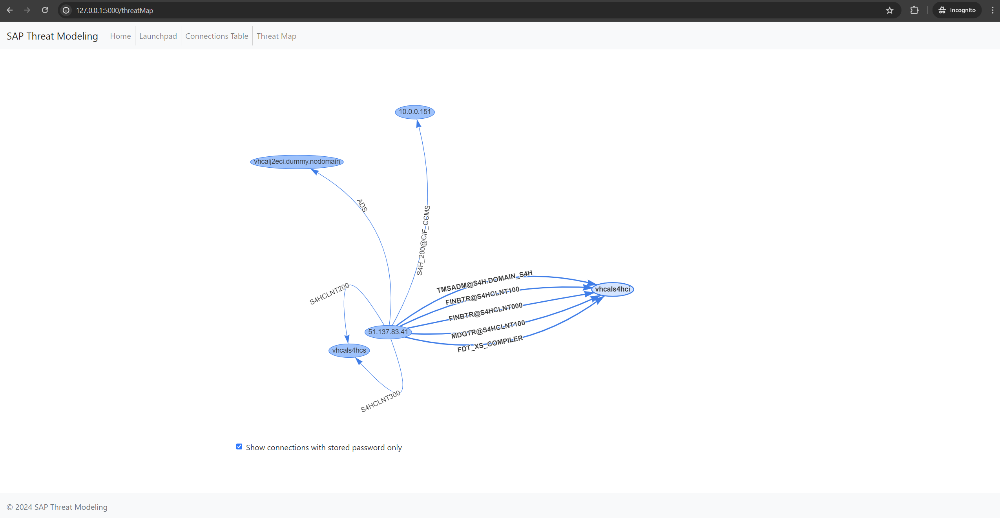

---

layout: col-sidebar
title: OWASP SAP Threat Modeling Builder
tags: sap, threat-modeling, sap-security-assessment, sap security, visualization
level: 2
type: tool
pitch: A comprehensive tool for visualizing and analyzing inter-SAP connections to identify potential security risks

---

## Overview

The OWASP SAP Threat Modeling Builder is an open-source project designed to help SAP Administrators, SAP Security Administrators, and other related professionals build an all-inclusive map of inter-SAP connections. This tool enables the identification of potential security risks and vulnerabilities within SAP environments, with a particular focus on detecting connections between production and non-production systems.

If you want to learn more about potential SAP threats, you can visit [RedRays Blog](https://redrays.io/blog/securing-sap-server-connections-threat-modeling/)
## Description

The SAP Threat Modeling Builder provides a user-friendly interface that allows users to:

1. Input credentials for multiple SAP systems
2. Scan for and discover inter-SAP connections
3. Visualize the SAP network as an interactive graph
4. Identify connections with potential security concerns
5. Filter connections based on specific criteria (e.g., stored passwords)

By providing a comprehensive view of SAP system interconnections, this tool aids in compliance efforts and helps identify potential security vulnerabilities.

## Key Features

- Credential management for multiple SAP systems
- Automated scanning and discovery of inter-SAP connections
- Graph-based visualization of the SAP network
- Tabular view of all connections for detailed analysis
- Filtering capabilities to focus on specific connection types
- Identification of connections between production and non-production systems
- Support for analyzing potential security risks

## Installation

1. Clone the repository:
   ```
   git clone https://github.com/redrays-io/SAP-Threat-Modeling-Tool.git
   ```

2. Install dependencies:
   ```
   pip install -r requirements.txt
   ```

3. Run the application:
   ```
   python app.py
   ```

4. Access the web interface: Open http://localhost:5000 in your browser.
   
   
   
   
5. 
## Docker Setup

Alternatively, you can set up the tool using Docker with the following command:

```
docker pull ghcr.io/redrays-io/sap-threat-modeling:latest
```

## Security Considerations

- **Credential Storage:** This tool stores SAP credentials in a local SQLite database. Ensure proper security measures for the database file.
- **Data Sensitivity:** The tool exposes information about SAP connections and potential vulnerabilities. Limit access to authorized personnel only.
- **Production Use:** This tool is intended for development and testing purposes. Evaluate its suitability before using it in production environments.
## Project Objectives

The main objectives of the OWASP SAP Threat Modeling Builder are:

1. To provide SAP professionals with a clear understanding of their SAP landscape's interconnectivity
2. To highlight potential security risks arising from inter-SAP connections
3. To assist in compliance efforts by identifying unauthorized or risky connections
4. To offer a visual representation of the SAP ecosystem for easier analysis and decision-making

## Use Cases

- Security Audits: Quickly assess the security posture of an organization's SAP landscape
- Compliance Checks: Ensure that production systems are properly isolated from non-production environments
- Risk Assessment: Identify and prioritize potential vulnerabilities in SAP system connections
- Change Management: Evaluate the impact of proposed changes to SAP system configurations

## Benefits

- Improved visibility into complex SAP landscapes
- Enhanced security through the identification of potential vulnerabilities
- Streamlined compliance processes
- Better decision-making for SAP administrators and security professionals
- Time savings in manual security assessments

## Getting Involved

We welcome contributions from the community. Here's how you can get involved:

- Join our mailing list for project updates and discussions
- Contribute to the project's development on GitHub
- Report issues or suggest enhancements through our issue tracker
- Share your experiences and use cases with the community
